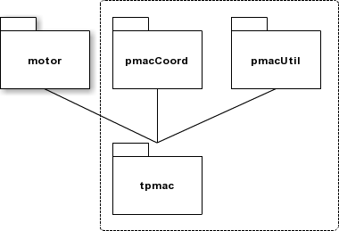

.. _introduction:

Introduction
============

The pmac module has been implemented as a replacement for the existing tpmac, pmacUtil and pmacCoord modules.  It contains updated type III asyn driver classes for both standard motors and for coordinate system axes.  It also implements trajectory scanning for PMAC motion controllers.  The communications method has been updated to improve the efficiency of status requests, by batching groups of status items into a single request message.

The diagram above illustrates the currently available EPICS modules that are replaced by the pmac module.  The three previously used EPICS modules would make multiple connections to the same Asyn port, but now all messages for the PMAC are managed by the broker present within the pmac module.  This provides tighter control of the data rates between the PMAC hardware and the module and can be used to monitor statistics and provide a snapshot of the controller variables.

The pmac module can send batches of demand positions to the PMAC hardware, and provides a motion program that places the controller into PVT mode and executes a trajectory scan of the positions.  The positions are written into dual buffers which allow the PMAC to be scanning one buffer whilst the module is filling the other buffer.

The pmac module supports PMAC coordinate systems, dynamic assignment of motors to coordinate systems, standard deferred moves as well as single point trajectory scans.  There is EPICS motor record support for raw motors and coordinate system axes.

