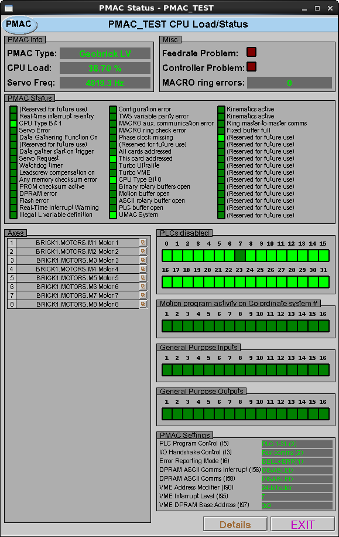
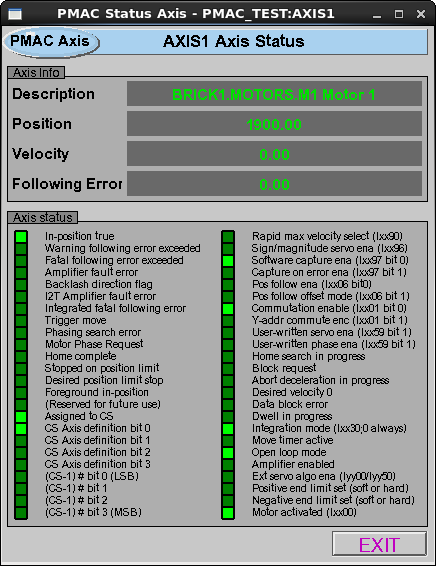
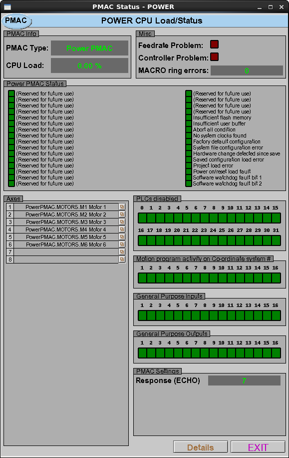
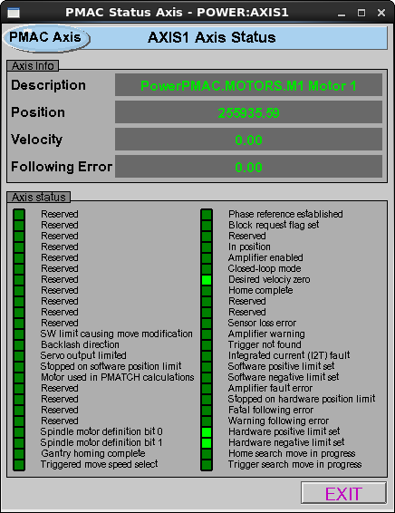
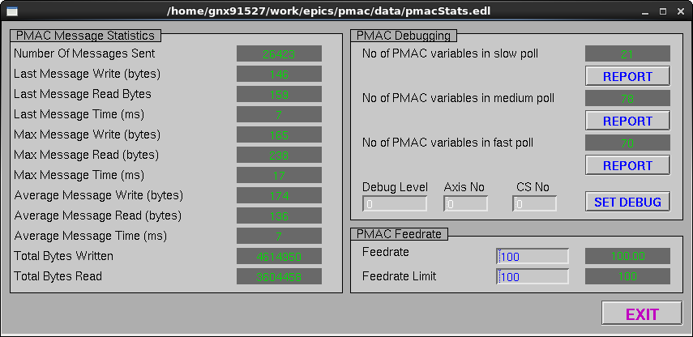
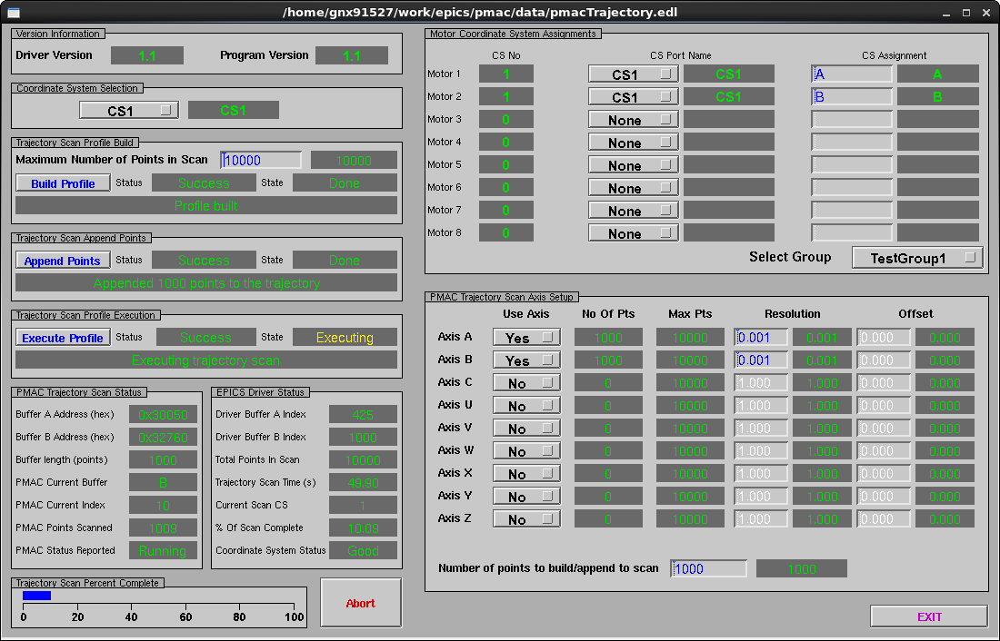

.. _user_guide:

User Guide
==========

This guide assumes an IOC has been built and is executing and connected to a PMAC. It describes the interactions with the EPICS PVs.

Status
------

The pmac module has records and edm screens for reporting the status of the PMAC hardware.  The following sections describe the engineering screens in more detail for each type of hardware that the pmac module supports.

Status (Geobrick)
*****************

The Geobrick status screen is shown below.  The "PMAC info" section displays the current hardware type, the CPU usage and the Servo Frequency.
Note that the reported CPU usage will only be correct if the CPU PLC is executing on the hardware.  The "Misc" section displays error indicators for either a feedrate error or a general controller problem.
The feedrate error will be set if the monitored feedrate drops below a specified threshold.  The "PMAC status" section displays the result of issuing a "???" to the hardware.
Each bit is decoded and displayed, for full details of each status item see the software reference manual.
The "Axes" section lists all of the available motors, with a button for opening the detailed status screen for each (see below).
The "PLCs Disabled" section shows the status of all PLCs on the hardware.  Note that light green means the PLC is NOT running and dark green means that the PLC is running.
Below this section are sections for the motion programs, and general purpose inputs and outputs.  For each program or I/O the indicator will be light green if switched on.
Finally the "PMAC Settings" section shows the current value of communications related monitored I variables on the hardware.

If one of the buttons is clicked next to the motor name then a detailed edm screen is opened for the motor.

Status (PowerPMAC)
******************

If one of the buttons is clicked next to the motor name then a detailed edm screen is opened for the motor.

Status Details and Debug
------------------------

::
  
  Report of PMAC medium store
  ===========================
  [M5011] => 1
  [M5010] => 1
  [M5013] => 1
  [M5012] => 1
  [M5015] => 1
  [M5014] => 1
  [M5017] => 1
  [M5016] => 1
  [M5019] => 1
  [M5018] => 1
  [M5035] => 0
  [M5031] => 1
  [M5030] => 1
  [M5580] => 0
  [M5880] => 0
  [M6380] => 0
  [I10] => 1705244
  [M5280] => 0
  [M5028] => 1
  [M5780] => 0
  [M7] => 0
  [M6080] => 0
  [M6480] => 0
  [M5980] => 0
  [M6280] => 0
  [M2] => 0
  [M3] => 0
  [M0] => 0
  [M1] => 0
  [M6] => 0
  [M5023] => 1
  [M4] => 0
  [M5] => 0
  [M6680] => 0
  [M8] => 0
  [M9] => 0
  [M5680] => 0
  [M6580] => 0
  [M5002] => 1
  [M5003] => 1
  [M5000] => 1
  [M5001] => 1
  [M5006] => 1
  [M5007] => 0
  [M5004] => 1
  [M5005] => 1
  [M5020] => 1
  [M5021] => 1
  [M5008] => 1
  [M5009] => 1
  [M5024] => 1
  [M5025] => 1
  [M5026] => 1
  [M5027] => 1
  [M5029] => 1
  [&1#1->,] => A
  [M13] => 0
  [M5180] => 0
  [M5480] => 0
  [M10] => 0
  [M11] => 0
  [M38] => 0
  [M39] => 0
  [M14] => 0
  [M15] => 0
  [M32] => 0
  [M33] => 0
  [M36] => 0
  [M37] => 0
  [M34] => 0
  [M35] => 0
  [cid] => 603382
  [M6180] => 0
  [&1#2->,] => B
  [M5380] => 0
  [P575] => 38.7
  [M5022] => 1
  [M12] => 0

Trajectory Scanning
-------------------

